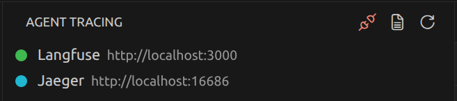
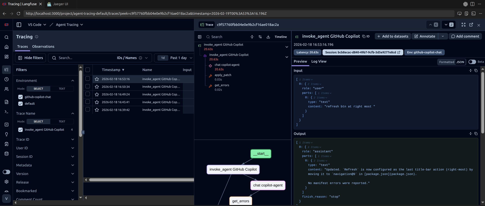
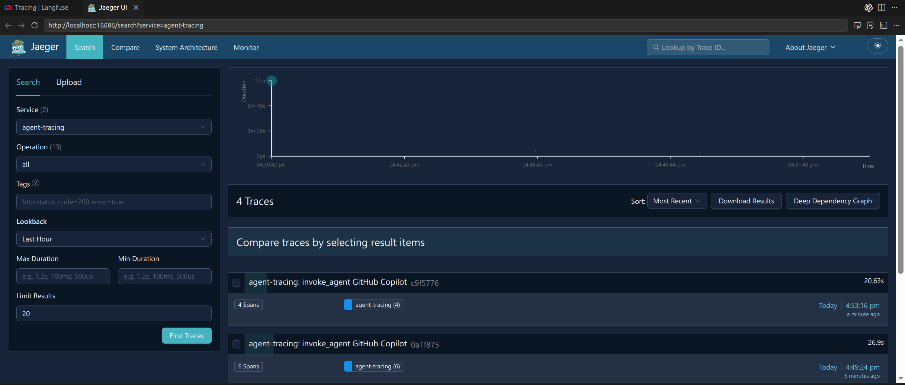

# Agent Tracing

**Local-first observability for AI coding agents.**  
One-click tracing setup for VS Code Copilot Chat and Claude with Langfuse — no cloud accounts required.

---

## Features

- **One-click setup** — Spins up Langfuse (Docker), installs hooks, wires API keys, opens the dashboard
- **Dual agent support** — Traces from both GitHub Copilot Chat and Claude sessions
- **Hook toggle** — Enable/disable tracing from the sidebar or command palette
- **Zero-config tracing** — Hooks fire automatically on every agent Stop event
- **Connect to existing** — Point at any running Langfuse instance (cloud or self-hosted)
- **Local-first** — All data stays on your machine in Docker volumes

## Quick Start

1. **Install** the extension from the VS Code Marketplace
2. Click the **Agent Tracing** icon in the Activity Bar
3. Click **▶ Setup** on the Langfuse row
4. Start using Copilot Chat or Claude — traces appear in the Langfuse dashboard

> Due to a Langfuse limitation, dashboard login is still required even in managed local mode.
> Use the inline **Login Info** row button (`$(account)`) on the Langfuse node to quickly copy credentials.

> Requires **Docker** (for the Langfuse stack) and **Python 3.8+** (for hook scripts — uses only stdlib, no pip packages needed).

> **Tip — auto-refresh:** The Langfuse traces table defaults to manual refresh. To see new traces automatically, click the **▾** dropdown next to the refresh button in the traces toolbar and select an interval (e.g. **30s**).

## Screenshots

### Sidebar



### Langfuse Dashboard



### Jaeger Dashboard



## How It Works

```
Agent Session → Stop Hook → Parse Transcript → Send to Langfuse → View in Dashboard
```

The extension uses the VS Code [hooks system](https://code.visualstudio.com/docs/copilot/customization/hooks) and Claude's [hooks](https://docs.anthropic.com/en/docs/claude-code/hooks) to capture session transcripts after each agent response.

A single shared Python script (`~/.claude/hooks/agent_tracing_hook.py`) detects the calling agent at runtime and handles both transcript formats. It emits standard **OpenTelemetry (OTLP JSON)** traces to all configured backends — no vendor SDK required.

Both agents share a single hook entry in `~/.claude/settings.json`:

- **VS Code Copilot Chat** reads env vars from the `env` field embedded in the hook object
- **Claude** reads env vars from the root-level `env` key in settings.json

This means one hook execution per event — no duplicates.

### What Gets Traced

| Data | Captured |
|------|----------|
| User prompts | ✅ |
| Assistant responses | ✅ |
| Reasoning/thinking text | ✅ |
| Tool invocations + results | ✅ |
| Subagent calls | ✅ |
| Session grouping | ✅ |
| Timing | ✅ |

## Sidebar

The sidebar shows a single flat tree view with inline actions on each backend node.

```
TRACING SOLUTIONS                                [↻]
├── Langfuse    Running — localhost:3000    [📄] [👤]
```

### Title Bar Controls

The Agent Tracing title bar contains global controls:

- **Hook: Install / Hook: Uninstall** (shared across both backends)
- **Hook: Enable VS Code Settings** (shown only when `chat.useHooks` / `chat.useClaudeHooks` are off)
- **Hook: Show Log**
- **Refresh**

### States

| State | Inline Icons | Right-click Menu |
|-------|-------------|-----------------|
| **Not configured** | ▶ Setup | — |
| **Running + hooks on** | 📄 Dashboard, 👤 Login Info | Open External, Stack Version, Stack: Stop, Recreate, Delete |
| **Running + hooks off** | 📄 Dashboard | Open External, Stack Version, Recreate, Delete |
| **Stopped + hooks on** | ▶ Start | Stack Version, Recreate, Delete |
| **Stopped + hooks off** | ▶ Start | Stack Version, Recreate, Delete |
| **Running (external)** | 📄 Dashboard, ⏹ Disconnect | Open External, Disconnect |
| **Docker not found** | ▶ Setup | — |

## File Layout

```
~/.claude/
├── settings.json              ← Hook entry (env embedded) + root env vars
└── hooks/
    ├── agent_tracing_hook.py  ← Shared OTLP hook script (both agents)
    └── .langfuse_config.json  ← Exporter endpoints + auth (written by extension)
```

## Commands

All commands are available via the Command Palette (`Ctrl+Shift+P` / `Cmd+Shift+P`):

| Command | Description |
|---------|-------------|
| `Agent Tracing: Start` | Full setup: backend + hooks + dashboard in one step |
| `Agent Tracing: Start` (Stack) | Start Langfuse containers (when already configured) |
| `Agent Tracing: Stop Stack` | Stop Langfuse containers (data preserved) |
| `Agent Tracing: Recreate Stack` | Rebuild containers, keep trace data |
| `Agent Tracing: Delete Stack` | Remove containers + all trace data |
| `Agent Tracing: Open Dashboard` | Open Langfuse in VS Code integrated browser |
| `Agent Tracing: Dashboard: Open in External Browser` | Open Langfuse in system browser |
| `Agent Tracing: Login Info` | Modal with email/password + copy buttons |
| `Agent Tracing: Connect to Existing Langfuse` | Connect to a running Langfuse instance |
| `Agent Tracing: Dashboard: Disconnect` | Disconnect from external instance |
| `Agent Tracing: Hook: Install` | Install tracing hooks (shared for Langfuse + Jaeger) |
| `Agent Tracing: Hook: Uninstall` | Remove tracing hooks (shared for Langfuse + Jaeger) |
| `Agent Tracing: Hook: Enable VS Code Settings` | Enable `chat.useHooks` + `chat.useClaudeHooks` |
| `Agent Tracing: Hook: Show Log` | Open the hook script log for debugging |
| `Agent Tracing: Info: Stack Versions` | Show pinned Langfuse Docker image versions |
| `Agent Tracing: Info: Jaeger Stack Versions` | Show Jaeger image and endpoint versions |
| `Agent Tracing: Refresh` | Refresh sidebar status |

## Settings

| Setting | Default | Description |
|---------|---------|-------------|
| `agentTracing.langfuse.port` | `3000` | Langfuse dashboard port |
| `agentTracing.langfuse.autoStart` | `false` | Auto-start Langfuse when VS Code opens |
| `agentTracing.additionalExporters` | `[]` | Additional OTLP backends (see [Multi-Backend Tracing](#multi-backend-tracing)) |

## Logging & Troubleshooting

The extension provides two independent logging layers. See [TROUBLESHOOTING.md](TROUBLESHOOTING.md) for full details.

### Extension Logs (TypeScript)

Open **Output** panel → select **"Agent Tracing"** from the dropdown. Supports log level filtering (Trace/Debug/Info/Warning/Error) via the gear icon.

### Hook Script Logs (Python)

The hook script writes to an aggregate log file:

| Log | Path | Purpose |
|-----|------|---------|
| **Aggregate** | `<globalStorage>/logs/hook.log` | All agents, all sessions — `tail -f` friendly |

Enable verbose stderr output:

```bash
# In ~/.claude/settings.json, add to the hook's env:
"CC_LANGFUSE_DEBUG": "true"
```

### Quick Diagnostics

```bash
# Watch all hook executions in real-time
tail -f ~/.config/Code/User/globalStorage/zhichli.vscode-agent-tracing/logs/hook.log

# Check if hooks are installed
cat ~/.claude/settings.json | python3 -m json.tool

# Check if Langfuse is reachable
curl -s http://localhost:3000/api/public/health
```

## Multi-Backend Tracing

The hook script emits standard **OTLP JSON** traces, so you can send data to any OpenTelemetry-compatible backend alongside Langfuse.

### Example: Add Jaeger

1. **Start Jaeger** (all-in-one with OTLP ingestion):

   ```bash
   docker run -d --name jaeger \
     -p 16686:16686 \
     -p 4318:4318 \
     jaegertracing/jaeger:2 \
     --set receivers.otlp.protocols.http.endpoint=0.0.0.0:4318
   ```

2. **Add the exporter** in VS Code settings (`settings.json`):

   ```json
   {
     "agentTracing.additionalExporters": [
       {
         "name": "jaeger",
         "endpoint": "http://localhost:4318/v1/traces"
       }
     ]
   }
   ```

3. **Re-enable hooks** (so the config is rewritten):
   - Command Palette → `Agent Tracing: Disable Hooks` then `Agent Tracing: Enable Hooks`

4. **View traces** at [http://localhost:16686](http://localhost:16686) (Jaeger UI) — or filter by `service=agent-tracing`.

### Other Backends

| Backend | Endpoint | Headers |
|---------|----------|---------|
| **Jaeger** | `http://localhost:4318/v1/traces` | — |
| **Grafana Tempo** | `http://localhost:4318/v1/traces` | — |
| **Honeycomb** | `https://api.honeycomb.io/v1/traces` | `{"x-honeycomb-team": "YOUR_KEY"}` |
| **Datadog** | `https://trace.agent.datadoghq.com/v1/traces` | `{"DD-API-KEY": "YOUR_KEY"}` |
| **Axiom** | `https://api.axiom.co/v1/traces` | `{"Authorization": "Bearer YOUR_TOKEN", "X-Axiom-Dataset": "agent-traces"}` |
| **SigNoz** | `http://localhost:4318/v1/traces` | — |

Each exporter receives the **same OTLP JSON payload** — the hook sends to all configured endpoints in parallel.

## Roadmap

- [ ] Per-agent trace filtering via `TRACE_AGENTS` env var
- [ ] Token/cost tracking per session
- [ ] Multi-workspace support
- [ ] Windows native path support

## Telemetry

This extension includes telemetry infrastructure via `@vscode/extension-telemetry` (Azure Application Insights). **Telemetry is not currently active** — no data is collected. When enabled in a future release, it will respect your VS Code `telemetry.telemetryLevel` setting and never collect file paths, project names, trace content, API keys, or hostnames.

## Contributing

See [CONTRIBUTING.md](CONTRIBUTING.md) for development setup, architecture overview, and contribution guidelines.

## License

MIT
